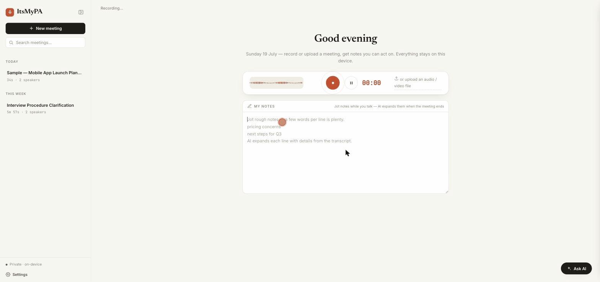

<div align="center">

# 🎙️ ItsMyPA

### Your meetings are being uploaded to someone else's computer. Stop that.

**ItsMyPA is an AI meeting notetaker that runs 100% on your Mac.**
Records, transcribes, tells speakers apart, and writes structured notes —
**no cloud, no account, no subscription, and your audio never leaves your machine.**

[**⬇️ Download for macOS (Apple Silicon)**](https://github.com/simpaira/itsmypa/releases/latest) · [Install guide](INSTALL.md) · [How it works](#how-it-works)



*Real capture: recorded, transcribed, diarized, and summarized 100% on-device.*

</div>

---

## The uncomfortable truth about AI notetakers

Every popular meeting notetaker works the same way: it records your meeting — your
salary negotiation, your health call, your company's roadmap, your customer's data —
and **ships the audio to a server you don't control**, where it's transcribed,
stored, and governed by a privacy policy you didn't read.

That bot in your meeting? It's a microphone that reports to someone else.

ItsMyPA does everything those tools do, **on your own hardware**:

|  | ☁️ Cloud notetakers | 🔒 ItsMyPA |
|---|---|---|
| Where your audio goes | Their servers | Never leaves your Mac |
| Account required | Yes, always | No |
| Monthly subscription | $8–30/mo forever | Free |
| Works offline | No | Yes (after first-run model download) |
| Who can read your meetings | Them, their vendors, subpoenas | You |
| A bot joins your call | Usually | Never — captures audio locally |

## What it does

- **One-button capture** — records your mic *and* the computer's meeting audio
  (Zoom, Meet, Teams, anything) natively. No bot joining your call, no
  tab-sharing dialog.
- **Transcription with speaker separation** — Whisper + speaker diarization tell
  "You" apart from Speaker 2 and 3, fully locally.
- **Structured AI notes** — Executive Summary, Key Decisions, Action Items with
  owners and checkboxes. Not a wall of text.
- **Granola-style scratchpad** — jot rough bullets during the meeting; AI expands
  each line with the decisions, numbers, and quotes from the transcript.
- **Ask your meeting anything** — chat with the transcript. "What did we agree
  about pricing?" Answered locally.
- **Note styles** — Standup / 1:1 / Sales call / Interview templates.
- **Follow-up email in one click**, auto-titles, Markdown export, calendar
  record-prompts, full-text search.

All of it powered by on-device models (Whisper, pyannote, TitaNet, a local LLM).
The first launch downloads them (~5 GB, one time). After that: airplane mode works.

## Get it

**Requirements:** Apple Silicon Mac (M1 or newer), macOS 13+, 16 GB RAM recommended.

1. [Download the latest DMG](https://github.com/simpaira/itsmypa/releases/latest)
2. Drag ItsMyPA to Applications
3. **First launch:** macOS will complain because we haven't paid Apple's $99/yr
   signing fee (we're indie — the code is public instead). Go to
   **System Settings → Privacy & Security → "Open Anyway"**. Full walkthrough
   with screenshots: [INSTALL.md](INSTALL.md)

Or with Homebrew (no Gatekeeper dance):

```bash
brew install --cask simpaira/tap/itsmypa
```

## "Unsigned? Why should I trust it?"

Fair question — the answer is better than a certificate: **the source code is
right here.** Read it, build it yourself, or watch its network traffic (spoiler:
after the one-time model download, there isn't any). A $99 Apple certificate
proves someone paid Apple $99. Open source proves what the app actually does.

Like the project? A ⭐ on this repo is free and helps more people find it.

---

## How it works

The speech stack runs on **sherpa-onnx** (ONNX Runtime): Whisper (int8) for
transcription, Silero VAD for speech chunking, and pyannote segmentation-3.0 +
NeMo TitaNet embeddings for speaker diarization. Summarization and chat use a
local GGUF LLM via `llama-cpp-python`. The native shell is Tauri; system audio
is captured through a ScreenCaptureKit helper (the same mechanism Granola uses).

Long recordings run as **background jobs**: the pipeline runs VAD, diarizes,
then decodes Whisper over ~28-second single-speaker windows. A failure partway
keeps everything transcribed so far; a browser timeout or laptop nap can't kill
a 90-minute job. While recording, audio chunks stream to disk every few seconds,
so a crash mid-meeting is recoverable.

The server binds to **127.0.0.1 only** by default.

## Run from source

```bash
./run.sh          # creates venv, installs deps, downloads models (~200 MB)
```

Then open **http://localhost:8765**. No Hugging Face token or account needed.

Tunables (via `.env` or environment): `WHISPER_MODEL` (tiny/base/small/medium/
large-v3, default `small`), `WHISPER_LANGUAGE` (default auto; non-Latin-script
languages transcribe noticeably better on `medium`+), `DIARIZE`, `NUM_SPEAKERS`,
`DIARIZE_THRESHOLD` (default 0.8), `CHAT_CONTEXT_WORDS`. The Settings UI (gear
icon) controls the common ones and persists them to `.env`.

Tests: `ITSMYPA_SKIP_MODELS=1 .venv/bin/python -m pytest tests/ -q`

## Build the desktop app

```bash
pip install -r requirements-dev.txt
./package/build_shell.sh          # → dist/ItsMyPA.dmg
```

The bundle is self-contained — engine, native audio-capture helper, and a static
ffmpeg are all included; a fresh machine needs nothing installed. Speech models
download to the app-data dir on first run (macOS:
`~/Library/Application Support/ItsMyPA`).

## Support the project

ItsMyPA is free. If it saved you a subscription, you can
[**buy me a coffee on Ko-fi** ☕](https://ko-fi.com/simpaira) — the first goal
is Apple's $99 signing fee, so the security warning at install goes away for
everyone. Every coffee is a brick in that wall.
